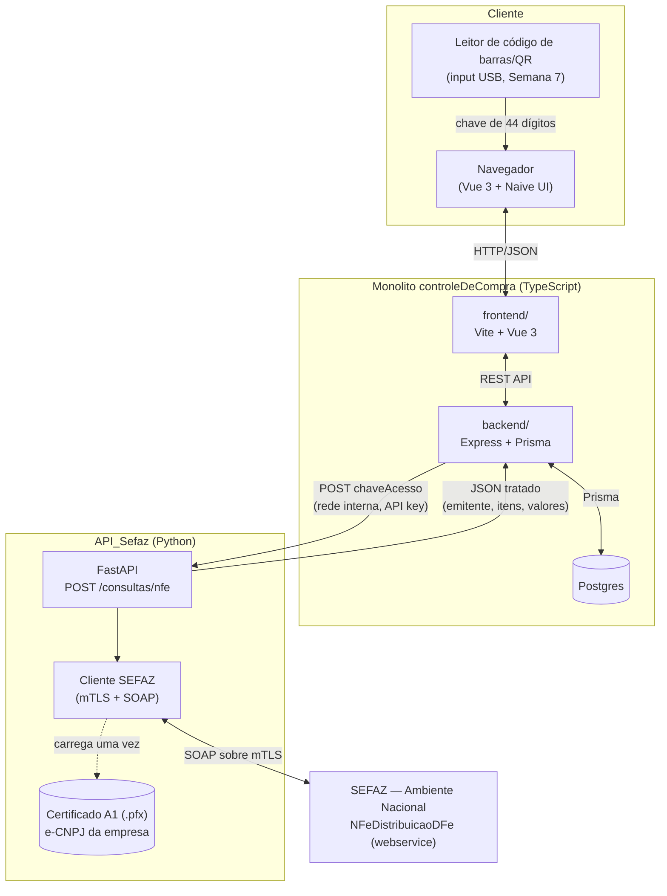
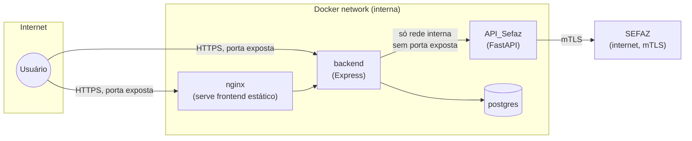
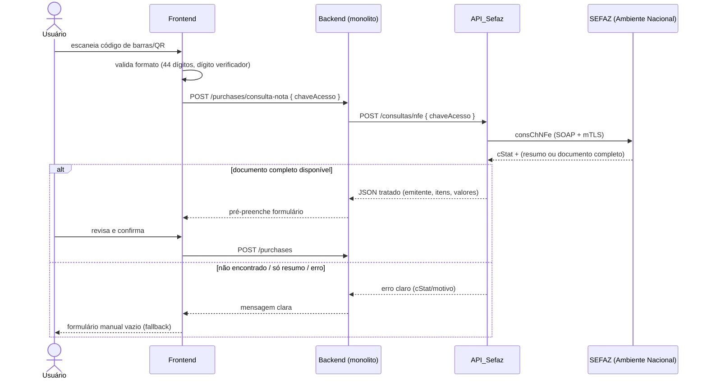

# Arquitetura Geral — Sistema de Compras

Visão de alto nível de como o **monolito `controleDeCompra`** (TypeScript) e o **serviço `API_Sefaz`**
(Python) se encaixam. Decisões detalhadas e o passo a passo de cada um estão nos respectivos
`TODO.md` — este documento é só o mapa de como as peças se conversam, pra não perdermos a visão
geral conforme o projeto cresce.

---

## 1. Componentes

**Por que dois serviços separados, em linguagens diferentes**: a integração com a SEFAZ depende
de SOAP + assinatura XML + certificado PKCS12, área onde o ecossistema Python (`zeep`, `signxml`,
`cryptography`) é mais maduro. Como a comunicação entre os dois é só HTTP/JSON, a escolha de
linguagem de um lado fica isolada e de baixo risco pro outro. Decisão completa registrada em
`API_Sefaz/TODO.md` (seção "Notas de decisão").

## 2. Rede / deploy

Ponto importante de segurança: **`API_Sefaz` não deve expor porta pra fora do `docker-compose`** —
só o `backend` do monolito fala com ele, dentro da rede interna. Isso limita a superfície de
ataque em cima de um serviço que guarda um certificado digital com validade jurídica (e-CNPJ).

## 3. Fluxo ponta a ponta (caminho feliz)

Detalhe do que acontece dentro de "documento completo disponível" (manifestação, resumo vs.
completo, regras de uso indevido) está em [`protocolo-sefaz.md`](protocolo-sefaz.md).

## 4. Decisões registradas (resumo — detalhe em cada TODO)

| Decisão | Onde foi registrada |
|---|---|
| Python pro `API_Sefaz`, isolado do monolito TS | `API_Sefaz/TODO.md` |
| Certificado A1 (e-CNPJ), não A3 | `API_Sefaz/TODO.md` |
| Webservice nacional `NFeDistribuicaoDFe` em vez de raspar HTML da SEFAZ-SC | `controleDeCompra/TODO.md` (Semana 8) |
| Naive UI, Express, estrutura de pastas do monolito | `controleDeCompra/TODO.md` (Notas de decisão) |

## 5. Referências

- [`TODO.md`](../TODO.md) (neste repo) — plano de trabalho e resultado dos testes da Fase 0
- [`docs/protocolo-sefaz.md`](protocolo-sefaz.md) (neste repo) — detalhe do protocolo SEFAZ (regras de uso indevido, manifestação, estados do documento)
- `controleDeCompra/TODO.md` (repo separado) — plano de trabalho do monolito
- `controleDeCompra/docs/erd.md` (repo separado) — schema do banco
- `controleDeCompra/docs/request-flow.md` (repo separado) — arquitetura em camadas do backend

> Nota: `controleDeCompra` e `API_Sefaz` são repositórios git separados — os três últimos links
> acima são referências de caminho local, não links clicáveis (não resolvem no GitHub, já que
> apontam pra fora deste repositório).
