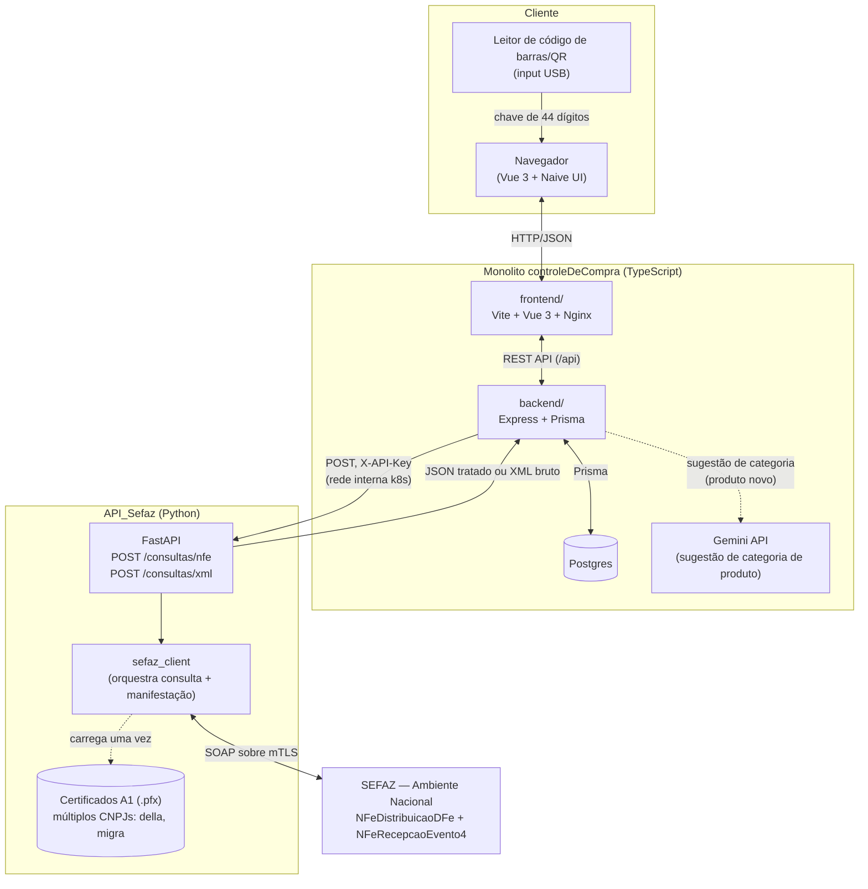
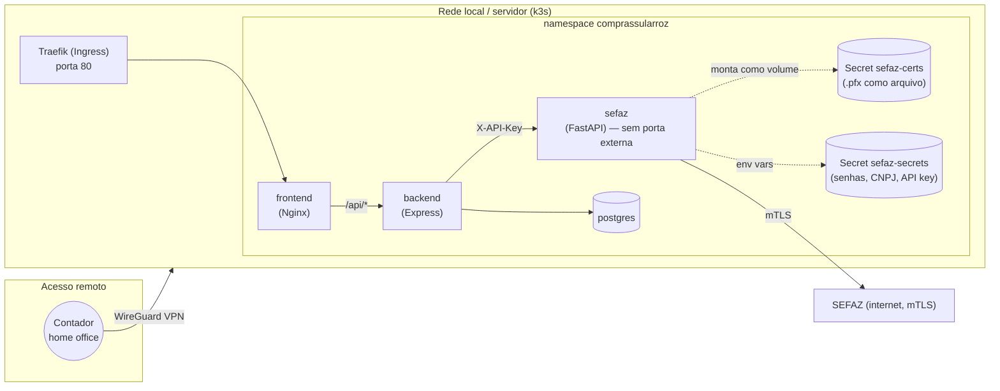
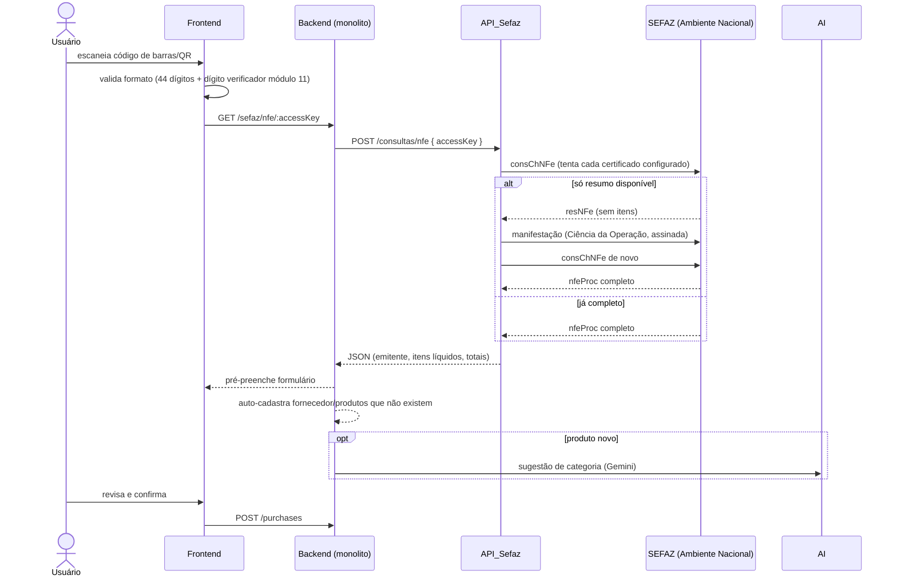
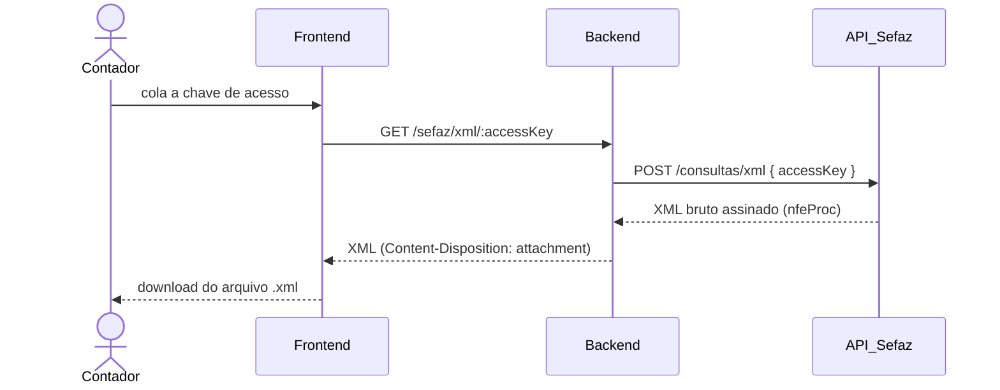

# Arquitetura Geral — Sistema de Compras

Visão de alto nível de como o **monolito `controleDeCompra`** (TypeScript) e o **serviço `API_Sefaz`**
(Python) se encaixam, e como tudo roda em produção. Atualizado em 06/08/2026.

---

## 1. Componentes

**Por que dois serviços separados, em linguagens diferentes**: a integração com a SEFAZ depende
de SOAP + assinatura XML + certificado PKCS12, área onde o ecossistema Python (`xmlsec`,
`cryptography`) é mais maduro. Como a comunicação entre os dois é só HTTP/JSON, a escolha de
linguagem de um lado fica isolada e de baixo risco pro outro.

## 2. Produção (Kubernetes/k3s)

Pontos importantes:
- **`sefaz` não expõe porta pra fora do cluster** — só o `backend` fala com ele, via `Service`
  `ClusterIP` (`http://sefaz:8000`), guardando um certificado com validade jurídica.
- **Certificados como Secret de arquivo**, não variável de texto — montados como volume em
  `/certs` dentro do pod (ver `k8s/deployment.yaml`).
- **Acesso remoto via VPN existente** (WireGuard, já usado pra outro sistema) — o contador
  acessa a rede local de casa, sem precisar expor o serviço na internet.

## 3. Fluxo ponta a ponta — pré-preencher formulário de compra

Detalhe de erros/regras de uso indevido está em [`protocolo-sefaz.md`](protocolo-sefaz.md).

## 4. Fluxo — "Consultar XML" (download avulso, ex: contador)

Cobre qualquer nota do CNPJ (não só as já lançadas como compra) — tenta cada certificado
configurado automaticamente, sem o usuário escolher qual.

## 5. Decisões registradas (resumo — detalhe em cada TODO)

| Decisão | Onde foi registrada |
|---|---|
| Python pro `API_Sefaz`, isolado do monolito TS | `API_Sefaz/TODO.md` |
| Certificado A1 (e-CNPJ), não A3 | `API_Sefaz/TODO.md` |
| Webservice nacional `NFeDistribuicaoDFe` em vez de raspar HTML da SEFAZ-SC | `controleDeCompra/TODO.md` (Semana 8) |
| Suporte a múltiplos CNPJs com detecção automática | `API_Sefaz/TODO.md` |
| Deploy em k3s (não docker-compose) com Secrets de arquivo pros certificados | `API_Sefaz/TODO.md`, `docs/deploy.md` (monolito) |
| Categorização de produto por IA (Gemini, tier gratuito) — sem MCP aqui, MCP é projeto separado | `controleDeCompra/TODO.md` |

## 6. Referências

- [`TODO.md`](../TODO.md) (neste repo) — plano de trabalho completo
- [`docs/protocolo-sefaz.md`](protocolo-sefaz.md) (neste repo) — protocolo SEFAZ em detalhe
- [`docs/estrutura-do-projeto.md`](estrutura-do-projeto.md) (neste repo) — mapa de pastas/arquivos
- `controleDeCompra/TODO.md` (repo separado) — plano de trabalho do monolito
- `controleDeCompra/docs/erd.md` (repo separado) — schema do banco
- `controleDeCompra/docs/request-flow.md` (repo separado) — arquitetura em camadas do backend
- `controleDeCompra/docs/deploy.md` (repo separado) — runbook de deploy no k3s

> Nota: `controleDeCompra` e `API_Sefaz` são repositórios git separados — os links pra lá acima
> são referências de caminho local, não resolvem no GitHub.