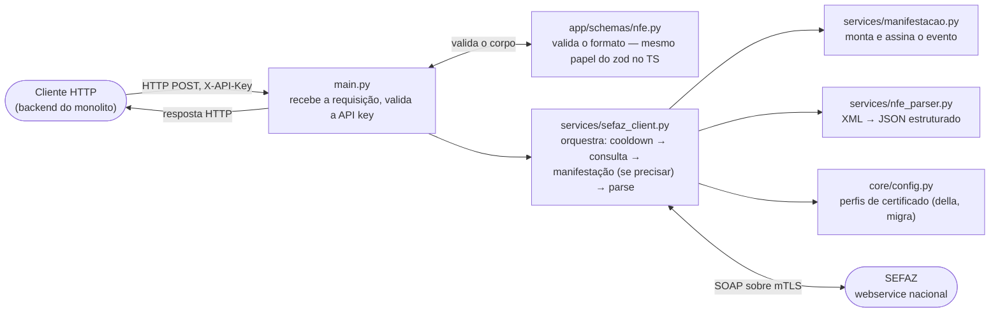

# Estrutura do Projeto — API_Sefaz

Mapa de pastas/arquivos do serviço. Atualizado em 06/08/2026, já com manifestação, multi-CNPJ,
rate limiting, logging, testes e deploy em produção (k3s).

---

## 1. Árvore de pastas e arquivos

```mermaid
flowchart TD
    Root["API_Sefaz/"]

    Root --> Env[".env — valores reais, nunca vai pro git"]
    Root --> EnvExample[".env.example — modelo, vai pro git"]
    Root --> Gitignore[".gitignore"]
    Root --> Todo["TODO.md — plano de trabalho, fases, decisões"]
    Root --> Readme["README.md — setup, endpoints, deploy (em inglês)"]
    Root --> Reqs["requirements.txt / requirements-dev.txt"]
    Root --> Dockerfile["Dockerfile — multi-stage, python:3.10-slim"]
    Root --> OpensslCnf["openssl_legacy.cnf — habilita SHA1\n(exigido pela assinatura da manifestação)"]
    Root --> Pocs["poc_consulta.py / poc_manifestacao.py\nscripts descartáveis da Fase 0\n(deixados como referência histórica)"]
    Root --> Docs["docs/"]
    Root --> App["app/"]
    Root --> Tests["tests/"]
    Root --> K8s["k8s/ — manifests de deploy (produção)"]
    Root --> Venv[".venv/ — nunca vai pro git"]

    Docs --> DocsArch["arquitetura-geral.md"]
    Docs --> DocsProto["protocolo-sefaz.md"]
    Docs --> DocsProtoCte["protocolo-cte-sefaz.md"]
    Docs --> DocsEstrutura["estrutura-do-projeto.md (este arquivo)"]

    App --> AppInit["__init__.py"]
    App --> Main["main.py — cria o FastAPI, registra endpoints,\nliga o logging estruturado"]
    App --> Core["core/"]
    App --> Services["services/"]
    App --> Schemas["schemas/"]

    Core --> Config["config.py — Settings (multi-certificado:\nCertificateProfile por CNPJ)"]
    Core --> Auth["auth.py — verify_api_key (X-API-Key)"]
    Core --> Logging["logging_config.py — logs em JSON,\nsem senha nem conteúdo da nota"]

    Services --> ServicesInit["__init__.py"]
    Services --> Certificate["certificate.py — carrega .pfx → PEM em memória"]
    Services --> SefazClient["sefaz_client.py — consulta consChNFe,\norquestra manifestação, tenta cada CNPJ"]
    Services --> CteClient["cte_client.py — pagina distNSU,\nfiltra client-side pela chave do CT-e"]
    Services --> Manifestacao["manifestacao.py — monta e assina\n(XML-DSig) o evento de Ciência da Operação"]
    Services --> NfeParser["nfe_parser.py — extrai emitente/itens/\nvalores do nfeProc, descontando vDesc"]
    Services --> RateLimiter["rate_limiter.py — cooldown local de 1h\napós 'não encontrado'"]

    Schemas --> SchemasInit["__init__.py"]
    Schemas --> NfeSchema["nfe.py — NFeQueryRequest, NfeItem, NfeParsed"]
    Schemas --> CteSchema["cte.py — CTeQueryRequest\n(valida modelo 57/67)"]

    Tests --> TestsInit["fixtures/ — XML de exemplo salvo localmente"]
    Tests --> TestNfeParser["test_nfe_parser.py"]
    Tests --> TestCteSchema["test_cte_schema.py"]
    Tests --> TestCteClient["test_cte_client.py"]

    K8s --> K8sDeploy["deployment.yaml — Secrets (certs + config),\nreadiness/liveness probe"]
    K8s --> K8sService["service.yaml — ClusterIP, só rede interna"]
```

## 2. Por que separado assim (camadas)

Mesma ideia do `controleDeCompra` (documentada em
[`controleDeCompra/docs/request-flow.md`](../../controleDeCompra/docs/request-flow.md)):
cada camada só conhece a de baixo, nunca a de cima.

## 3. O que cada arquivo faz, em uma frase

| Arquivo/pasta | O que faz | Analogia com o `controleDeCompra` (TS) |
|---|---|---|
| `app/main.py` | Cria o FastAPI, registra os 4 endpoints (`/health`, `/consultas/nfe`, `/consultas/xml`, `/consultas/cte/xml`) | `backend/src/index.ts` + `routes/*.routes.ts` |
| `app/core/config.py` | Lê/valida env vars; monta um `CertificateProfile` por CNPJ configurado | Não tem equivalente direto — TS lê `process.env` espalhado |
| `app/core/auth.py` | Confere o header `X-API-Key` em toda rota (exceto `/health`) | `backend/src/middlewares/authenticate.ts` |
| `app/core/logging_config.py` | Formata logs como JSON, uma linha por evento | Não existe ainda do lado TS |
| `app/services/certificate.py` | Abre o `.pfx`, devolve chave+certificado em PEM (memória, nunca disco) | Sem equivalente |
| `app/services/sefaz_client.py` | O "maestro": consulta, decide se precisa manifestar, tenta cada certificado | `backend/src/services/*.service.ts` |
| `app/services/cte_client.py` | Cliente do CT-e — sem consulta por chave, pagina `distNSU` e filtra client-side; sem manifestação (não implementada, status incerto — ver `docs/protocolo-cte-sefaz.md`) | Sem equivalente |
| `app/services/manifestacao.py` | Monta e assina digitalmente (XML-DSig) o evento de Ciência da Operação | Sem equivalente |
| `app/services/nfe_parser.py` | Converte o XML da nota em JSON estruturado, já descontando `vDesc` por item | Sem equivalente |
| `app/services/rate_limiter.py` | Trava local de 1h por `(CNPJ, chave)` — evita bloqueio da própria SEFAZ | Sem equivalente |
| `app/schemas/nfe.py` | Formatos Pydantic de entrada/saída dos endpoints | `backend/src/schemas/*.schema.ts` (zod) |
| `app/schemas/cte.py` | `CTeQueryRequest` — valida 44 dígitos + modelo 57/67 (pega chave de NF-e cedo, antes de consultar) | `backend/src/schemas/*.schema.ts` (zod) |
| `tests/` | Testes automatizados (pytest), com XML de exemplo salvo — não bate na SEFAZ real | `backend/src/**/__tests__/*.test.ts` (Jest) |
| `k8s/` | Manifests de deploy em produção (Deployment + Service, sem porta externa) | Manifests equivalentes vivem só no servidor (não versionados) pro monolito |
| `Dockerfile` | Build multi-stage (`python:3.10-slim`), inclui libs nativas do `xmlsec` | `backend/Dockerfile` (Node) |
| `poc_consulta.py` / `poc_manifestacao.py` | Scripts descartáveis da Fase 0 — provaram que a integração funcionava antes do serviço de verdade existir. Mantidos como referência histórica, não fazem parte do app | Sem equivalente |

## 4. Referências

- [`arquitetura-geral.md`](arquitetura-geral.md) — como este serviço se encaixa com o `controleDeCompra`
- [`protocolo-sefaz.md`](protocolo-sefaz.md) — regras específicas do webservice de NF-e
- [`protocolo-cte-sefaz.md`](protocolo-cte-sefaz.md) — regras específicas do webservice de CT-e
- [`controleDeCompra/docs/request-flow.md`](../../controleDeCompra/docs/request-flow.md) — o mesmo padrão de camadas, do lado TypeScript