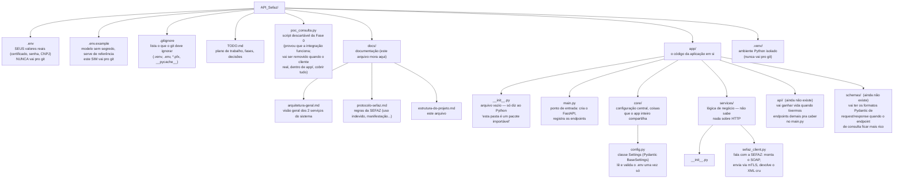
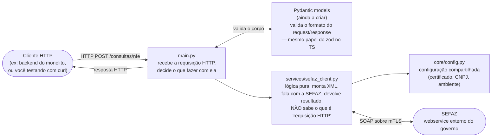

# Estrutura do Projeto — API_Sefaz

Mapa de pastas/arquivos do serviço, pra quem está vendo uma API pela primeira vez entender o que
cada peça faz e por que existe. Reflete o estado real do projeto nesta data (30/07/2026) — conforme
crescer (Fase 2 em diante), este doc precisa ser atualizado junto.

---

## 1. Árvore de pastas e arquivos

## 2. Por que separado assim (camadas)

Mesma ideia do `controleDeCompra` (documentada em
[`controleDeCompra/docs/request-flow.md`](../../controleDeCompra/docs/request-flow.md)):
cada camada só conhece a de baixo, nunca a de cima. Isso facilita testar cada pedaço isolado e
trocar uma peça sem quebrar as outras.

**Regra chave**: só o `main.py` (e futuramente `app/api/*.py`) deveria "saber" que existe uma
requisição HTTP. `services/sefaz_client.py` recebe uma chave de acesso (uma `string` comum) e
devolve um resultado — ele funcionaria igual se fosse chamado por um teste automatizado, por uma
linha de comando, ou por um endpoint. Isso é o que torna a lógica fácil de testar sem precisar
subir um servidor inteiro.

## 3. O que cada arquivo faz, em uma frase

| Arquivo/pasta | O que faz | Analogia com o `controleDeCompra` (TS) |
|---|---|---|
| `app/main.py` | Cria a aplicação FastAPI e registra os endpoints | `backend/src/index.ts` + `routes/*.routes.ts` |
| `app/core/config.py` | Lê e valida as variáveis de ambiente uma vez, no início | Não tem equivalente direto — o TS lê `process.env` espalhado com `dotenv` |
| `app/services/sefaz_client.py` | Lógica de negócio: fala com a SEFAZ | `backend/src/services/*.service.ts` |
| `app/api/` (futuro) | Quando os endpoints crescerem, saem do `main.py` e viram arquivos próprios aqui | `backend/src/routes/*.routes.ts` + `controllers/*.controller.ts` |
| `app/schemas/` (futuro) | Formatos Pydantic de entrada/saída dos endpoints | `backend/src/schemas/*.schema.ts` (zod) |
| `.env` / `.env.example` | Configuração sensível vs. modelo público | Mesmo padrão já usado no `controleDeCompra` |
| `poc_consulta.py` | Script isolado que só existiu pra provar que a integração com a SEFAZ funciona antes de construir o serviço de verdade | Não tem equivalente — foi só uma etapa de validação (Fase 0) |

## 4. Por que `api/` e `schemas/` ainda não existem

De propósito — a regra que temos seguido neste projeto é criar estrutura **quando o código que vai
morar ali já existe**, não antes. Com só 2 endpoints (`/health` e o futuro `/consultas/nfe`), tudo
cabe direto no `main.py` sem ficar confuso. Quando isso crescer (mais endpoints, schemas mais
ricos), a gente separa — daí esse doc é atualizado junto.

## 5. Referências

- [`arquitetura-geral.md`](arquitetura-geral.md) — como este serviço se encaixa com o `controleDeCompra`
- [`protocolo-sefaz.md`](protocolo-sefaz.md) — regras específicas do webservice da SEFAZ
- [`controleDeCompra/docs/request-flow.md`](../../controleDeCompra/docs/request-flow.md) — o mesmo padrão de camadas, do lado TypeScript
