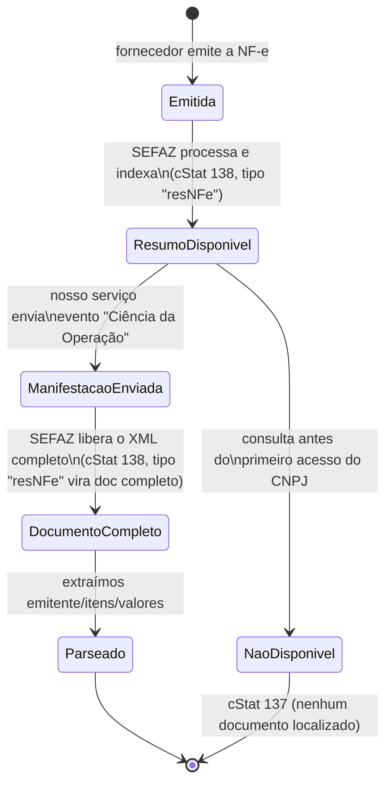
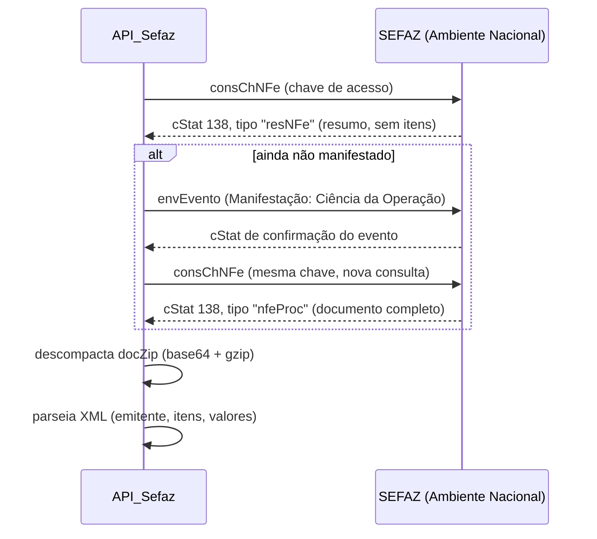

# Protocolo SEFAZ — Distribuição DFe

Notas de uso do webservice nacional `NFeDistribuicaoDFe`, baseadas no que foi validado na
Fase 0 do `TODO.md` (testes reais com o certificado da empresa) e na Nota Técnica 2014.002 /
Manual de Orientação do Contribuinte (MOC). Objetivo deste documento: ninguém precisar redescobrir
essas regras de novo lendo blog de fornecedor de software fiscal — ficam registradas aqui.

⚠️ Onde não tivemos 100% de certeza (fontes secundárias divergiam entre si), está marcado
explicitamente como "não confirmado" — vale validar contra o manual oficial (MOC, CONFAZ) antes
de decisões críticas de produção.

---

## 1. Dois tipos de consulta

O mesmo webservice (`nfeDistDFeInteresse`) aceita 3 formatos de pedido, escolhidos pela tag usada
dentro de `distDFeInt`:

| Tag | Uso | Quando usamos |
|---|---|---|
| `consChNFe` | Consulta **pontual por chave de acesso** (44 dígitos) | Fluxo principal: usuário escaneia o código de barras |
| `distNSU` | Varre o fluxo de novidades **sequencialmente**, a partir de um `ultNSU` | Não é o uso principal do projeto, mas foi essencial pra diagnosticar a Fase 0 (ver `maxNSU`) |
| `consNSU` | Consulta um NSU específico já conhecido | Não usado no projeto |

## 2. Ciclo de vida de um documento (Resumo → Manifestação → Completo)



**Hipótese parcialmente corrigida (30-31/07/2026)**: achávamos que só notas emitidas *depois*
do primeiro acesso do CNPJ ficariam disponíveis. Na prática, uma chave que retornou `cStat 137`
na primeira tentativa (nota emitida antes do primeiro acesso) passou a retornar `cStat 138`
(documento localizado) horas depois, no mesmo dia. Parece existir um atraso de indexação que
eventualmente libera histórico também, não só notas futuras — mecanismo exato não confirmado,
só o resultado observado.

**Confirmado com nota real (31/07/2026)**: sem manifestação, o `docZip` traz só o **Resumo da
NF-e** (`resNFe`), com estes campos: `chNFe`, `CNPJ`/`xNome` (emitente), `dhEmi`, `vNF` (valor
total), `nProt`, `cSitNFe`. **Não vêm os itens** (produto/quantidade/valor unitário) — só no
`nfeProc` completo, depois da manifestação.

**Implicação de escopo**: sem enviar o evento de manifestação, só o **Resumo** fica disponível —
não dá pra pré-preencher itens/quantidades/valores só com o resumo. O `API_Sefaz` precisa
implementar o envio da manifestação como parte do fluxo, não só a consulta (item já adicionado
ao `TODO.md`, Fase 2).

✅ **Confirmado (03/08/2026)**: o tempo entre enviar a manifestação e o documento completo ficar
disponível é **imediato** — mandamos a Ciência da Operação e a próxima consulta (`consChNFe`) já
veio com o `nfeProc` completo (emitente, 5 itens com valores/impostos, totais, protocolo de
autorização original da nota). Fluxo ponta a ponta validado com nota real.

## 3. Fluxo de consulta + manifestação (detalhado)



## 3.5. Manifestação do Destinatário — o que é e como funciona

Pesquisa feita em 31/07/2026 porque tínhamos receio de ser algo burocrático (contato com a SEFAZ,
documentos). **Não é** — é só mais uma chamada de webservice, com o mesmo certificado, só que com
uma exigência técnica a mais: o XML precisa vir **assinado digitalmente** (diferente da consulta,
que só usa o certificado pra autenticar a conexão mTLS, sem assinar o conteúdo).

### Os 4 tipos de evento

| Evento | `tpEvento` | O que significa | Obrigatório? |
|---|---|---|---|
| Ciência da Operação/Emissão | 210210 | "Estou ciente que essa nota existe pro meu CNPJ" — não confirma nem nega nada | **Opcional**, sempre — é o único que não exige decisão de negócio |
| Confirmação da Operação | 210200 | Confirma que a compra aconteceu de fato | Obrigatório só pra categorias reguladas (combustível, cigarro, bebida alcoólica/refrigerada, quando destinado a distribuidor/atacadista) |
| Desconhecimento da Operação | 210220 | "Não reconheço essa operação" | Mesma regra acima |
| Operação Não Realizada | 210240 | "A operação não aconteceu" (recusou entrega, etc.) | Mesma regra acima |

**Pro nosso caso** (compras de manutenção — rolamento, folha A4, correia — não são as categorias
regulamentadas acima): só a **Ciência da Operação** é relevante pro `API_Sefaz`, e ela é
justamente a que não compromete a empresa com nada — só destrava a visualização do XML completo.
A Confirmação/Desconhecimento/Operação Não Realizada, se forem legalmente exigidas pro tipo de
compra da empresa, são decisão de negócio/contábil, fora do escopo do software por enquanto —
confirmar com o contador se aplica.

⚠️ **Prazo legal (não é sobre o software, é sobre a empresa)**: existe um prazo pra registrar um
dos eventos conclusivos quando aplicável. Fontes conflitam: uma diz 180 dias a partir da
autorização da NF-e, outra diz que caiu pra **90 dias a partir de 01/06/2026** (Ajuste SINIEF
14/2026). Não confirmado com certeza — checar com o contador antes de depender desse número.

### Estrutura do XML (evento assinado)

```xml
<envEvento xmlns="http://www.portalfiscal.inf.br/nfe" versao="1.00">
  <idLote>000000013199210</idLote>
  <evento xmlns="http://www.portalfiscal.inf.br/nfe" versao="1.00">
    <infEvento Id="ID210210[chNFe 44 dígitos][nSeqEvento 2 dígitos]">
      <cOrgao>[código IBGE da UF]</cOrgao>
      <tpAmb>1</tpAmb>
      <CNPJ>[CNPJ da empresa]</CNPJ>
      <chNFe>[chave de acesso da nota]</chNFe>
      <dhEvento>[timestamp ISO 8601 com timezone]</dhEvento>
      <tpEvento>210210</tpEvento>
      <nSeqEvento>1</nSeqEvento>
      <verEvento>1.00</verEvento>
      <detEvento versao="1.00">
        <descEvento>Ciencia da Operacao</descEvento>
      </detEvento>
    </infEvento>
    <Signature xmlns="http://www.w3.org/2000/09/xmldsig#">
      <!-- assinatura sobre o <infEvento>, canonicalização c14n, RSA-SHA1 -->
    </Signature>
  </evento>
</envEvento>
```

- **Onde assina**: o `<infEvento>` inteiro (referenciado pelo `Id`), não o `<envEvento>` todo.
- **Biblioteca usada de fato**: `xmlsec` (bindings Python pra `libxmlsec1`), **não** `signxml` — o `signxml`
  bloqueia SHA1 por padrão, sem nenhuma forma de destravar via configuração (confirmado lendo o
  código-fonte da biblioteca), e o schema da SEFAZ exige exatamente RSA-SHA1. Outros projetos Python
  de NFe reais (ex: `PyTrustNFe`) usam `xmlsec` pelo mesmo motivo.
- **Pegadinhas reais que encontramos implementando** (pra não redescobrir):
  1. `xmlsec` exige pacotes de sistema (`libxmlsec1-dev`, `pkg-config`), não só `pip install`.
  2. **OpenSSL 3 desativa SHA1 pro `libxmlsec1` por padrão** ("failed to sign" genérico) — precisa
     ativar o provider `legacy` do OpenSSL via `OPENSSL_CONF` apontando pra um `.cnf` customizado.
  3. O atributo `Id` do `infEvento` **não é reconhecido automaticamente** como um ID de verdade pelo
     `libxml2` — precisa registrar explicitamente com `xmlsec.tree.add_ids(node, ["Id"])` antes de
     assinar, ou a assinatura falha com um erro de XPointer/`xpointer(id(...))` não encontrado.
  4. **`cOrgao` dentro do `infEvento` é sempre `91`** (código fixo do Ambiente Nacional) — **não** é a
     UF da empresa nem a UF do emitente da nota. Usar a UF errada aqui dá `cStat 657`
     ("Código do Órgão diverge do órgão autorizador").
- **Segurança da assinatura em trânsito**: a chave privada nunca sai da máquina. O que trafega é o
  `SignatureValue` (resultado de mão única — não dá pra reconstruir a chave privada a partir dele)
  e o certificado **público** (`X509Certificate`, mesmo dado que já vimos com `openssl` na Fase 0).
  A conexão em si já é protegida por TLS/mTLS, como a consulta que já validamos.

### ⚠️ A resposta vem em duas camadas — atenção ao parsear

```xml
<retEnvEvento>
  <cStat>128</cStat>              <!-- status do LOTE, não do evento -->
  <xMotivo>Lote de evento processado</xMotivo>
  <retEvento>
    <infEvento>
      <cStat>135</cStat>          <!-- status do EVENTO em si — este é o que importa -->
      <xMotivo>Evento registrado e vinculado a NF-e</xMotivo>
      <nProt>...</nProt>
    </infEvento>
  </retEvento>
</retEnvEvento>
```

Um parser ingênuo que pega só a **primeira** ocorrência de `<cStat>`/`<xMotivo>` no XML vai ler o status do **lote** (sempre `128` se o lote em si foi aceito), não o do evento. O status que decide sucesso/falha real está **aninhado** dentro de `retEvento > infEvento`. Descoberto na prática em 03/08/2026 — nosso primeiro teste real bateu nisso.

### `cStat` específicos deste webservice (diferente da consulta)

| cStat | Significado | Ação |
|---|---|---|
| **135** | Evento registrado e vinculado à NF-e | **Único código tratado como sucesso** — segue e consulta de novo pra pegar o doc completo (confirmado: liberação é imediata) |
| 128 | Lote de evento processado | ⚠️ Isso é o status do **lote**, não do evento — aparece sempre antes do `cStat` real (aninhado em `retEvento > infEvento`). Não confundir com sucesso do evento em si |
| 136 | Evento registrado, mas **não vinculado** à NF-e | Parar e reportar — não é sucesso completo, algo não bateu |
| 640 | Ciência não pode ocorrer depois de manifestação final já registrada | Parar e reportar |
| 650 | Evento inválido pra nota cancelada/denegada | Parar e reportar |
| 657 | Rejeição: Código do Órgão diverge do órgão autorizador | Bug nosso — `cOrgao` errado (corrigido: sempre `91`, não a UF da empresa) |

Regra do projeto (decidida em 31/07/2026, "segurança em primeiro lugar"): **só o `cStat 135`
é tratado como sucesso**. Qualquer outro código — incluindo os listados acima e qualquer coisa
não reconhecida — interrompe o fluxo e é reportado, sem tentar interpretar ou repetir sozinho.

## 4. Regras de uso indevido (anti-abuso) — o que já validamos

Confirmado testando na prática (Fase 0) + pesquisa complementar:

| Regra | Detalhe | Fonte |
|---|---|---|
| Limite por chave/NSU | Até **20 consultas por chave de acesso (ou por NSU) por hora** | blog NS Tecnologia / Inventti (secundária) |
| Escopo do bloqueio | **Por CNPJ inteiro** — não é só a chave específica que fica bloqueada, é todo o certificado/CNPJ | Inventti (secundária) |
| Duração do bloqueio | 1 hora, desbloqueio automático | confirmado na prática (Fase 0) |
| Reconsulta após `cStat 137` | Consultar de novo **antes de completar 1h** depois de um "nenhum documento localizado" já conta como uso indevido, mesmo estando bem abaixo do limite de 20 | confirmado na prática (Fase 0) — levamos `cStat 656` |
| `distNSU` fora de ordem | Pular pra um NSU arbitrário (não usar o `ultNSU` exato da resposta anterior) conta como uso indevido | confirmado na prática (Fase 0) — levamos `cStat 656` ao pular de NSU 50 pra 6552 |
| Múltiplas instâncias do mesmo CNPJ | Se mais de um processo/app consultar pelo mesmo CNPJ, todos precisam respeitar a mesma sequência ascendente de NSU — do contrário conta como uso indevido | Inventti (secundária) |
| ⚠️ **Escalada de bloqueio** | Bloqueios repetidos (`cStat 656`) fazem o tempo de bloqueio **aumentar** a cada reincidência. Depois de mais de **50 bloqueios de 60 min consecutivos**, a SEFAZ pode bloquear o **CNPJ ou IP permanentemente** — só resolve entrando em contato direto com a SEFAZ. Não afeta o certificado nem a capacidade da empresa de emitir/receber notas reais, é isolado a esse canal. | Oobj / Vinco (secundárias, pesquisa 31/07/2026) |

### O que isso significa pra arquitetura do `API_Sefaz`

- **Um único ponto de acesso ao certificado/CNPJ** — não pode ter dois processos (ex: a API e um
  script de sync separado) fazendo consultas concorrentes pro mesmo CNPJ sem coordenação, sob risco
  de bloquear a integração inteira por 1h.
- **Nunca implementar retry automático** em cima de `cStat 137` — cai pro fluxo manual (já é o
  comportamento planejado no `controleDeCompra/TODO.md`, Dia 30) e só permite nova tentativa da
  mesma chave depois de 1h.
- **Persistir o `ultNSU`** como estado durável (não em memória) — se o processo reiniciar e
  "esquecer" o cursor, o próximo `distNSU` pode ficar fora de ordem e gerar bloqueio.
- Um bloqueio (`cStat 656`) trava **todas as consultas daquele CNPJ**, inclusive o fluxo principal
  de escanear notas — vale ter um circuito de "aguarde X minutos" visível pro usuário no frontend,
  em vez de só um erro genérico.

## 5. `cStat` relevantes encontrados até agora

| cStat | Significado | Ação esperada |
|---|---|---|
| 138 | Documento(s) localizado(s) | Processar o `docZip` |
| 137 | Nenhum documento localizado | Cair pro formulário manual; não tentar de novo antes de 1h |
| 656 | Consumo indevido (bloqueio de 1h) | Avisar o usuário, aguardar; não é erro de bug |
| 215 | Rejeição: falha no esquema XML | Bug no nosso envelope (aconteceu na Fase 0 por um namespace errado — corrigido) |
| 217 | Rejeição: NF-e inexistente para a chave de acesso informada | Mais uma forma de "não encontrado" — tratado igual ao 137/640 (tenta o próximo certificado, registra cooldown) |
| 236 | Rejeição: Chave de Acesso com dígito verificador inválido | Chave mal formada/digitada errado — não é erro da SEFAZ nem nosso, é a chave em si estando errada |
| 640 (na consulta) | Rejeição: CNPJ/CPF do interessado não possui permissão pra consultar essa NF-e | ⚠️ Mesmo número do `640` da manifestação, **significado diferente** — aqui é "não é desse CNPJ", tratado igual a "não encontrado" |

## 6. Referências

- [Nota Técnica 2014.002 — Web Service de Distribuição de DF-e (portal oficial NF-e)](https://www.nfe.fazenda.gov.br/portal/exibirArquivo.aspx?conteudo=wLVBlKchUb4%3D)
- [Manual de Orientação do Contribuinte (MOC) — CONFAZ](https://www.confaz.fazenda.gov.br/legislacao/arquivo-manuais/moc7-visao-geral.pdf)
- [cStat 137 — Nenhum documento localizado (WebGer)](https://webger.com.br/cstat-137-nenhum-documento-localizado-para-o-destinatario/)
- [Regras de Consumo Indevido para DFe (NS Tecnologia)](https://blog.nstecnologia.com.br/regras-de-consumo-indevido-para-dfe/)
- [Atualização das Regras de Uso Indevido do Web Service NFeDistribuicaoDFe (Inventti)](https://inventti.com.br/nf-e-atualizacao-das-regras-de-uso-indevido-do-web-service-nfedistribuicaodfe/)
- [Sefaz poderá bloquear permanentemente por Consumo Indevido (Oobj)](https://oobj.com.br/legislacao/sefaz-bloquear-consumo-indevido/)
- [Manifestação do destinatário na NF-e: NT 2020.001 (Nota Gateway)](https://notagateway.com.br/blog/manifestacao-do-destinatario-na-nf-e-entenda-a-recente-nt-2020-001-v1-10-e-os-prazos-atualizados/)
- [Manifestação do destinatário: NT 2020.001 v1.60 reduz prazo pra 90 dias (Sped Brasil)](https://spedbrasil.com.br/manifestacao-destinatario-nfe-2020-001-v160/)
- [SignXML — biblioteca Python de assinatura XML](https://xml-security.github.io/signxml/)
- Resultado dos testes reais: `API_Sefaz/TODO.md`, seção "Fase 0"
