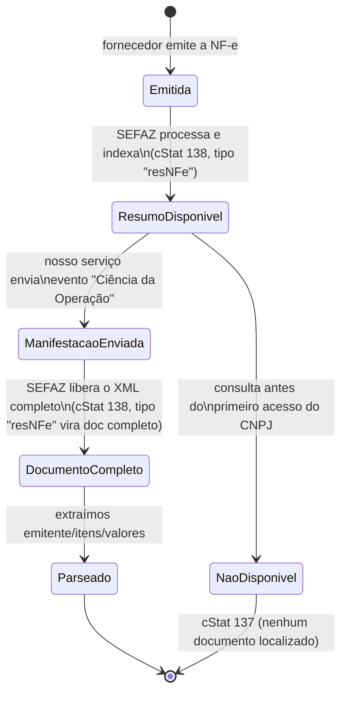
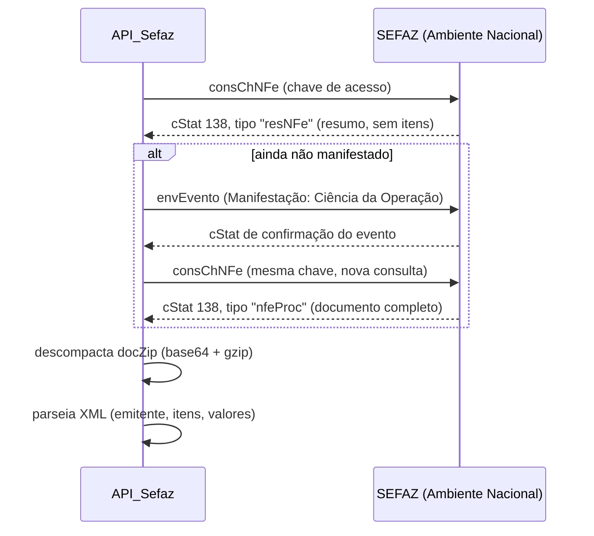

# Protocolo SEFAZ — Distribuição DFe

Notas de uso do webservice nacional `NFeDistribuicaoDFe`, baseadas no que foi validado na
Fase 0 do `TODO.md` (testes reais com o certificado da empresa) e na Nota Técnica 2014.002 /
Manual de Orientação do Contribuinte (MOC). Objetivo deste documento: ninguém precisar redescobrir
essas regras de novo lendo blog de fornecedor de software fiscal — ficam registradas aqui.

⚠️ Onde não tivemos 100% de certeza (fontes secundárias divergiam entre si), está marcado
explicitamente como "não confirmado" — vale validar contra o manual oficial (MOC, CONFAZ) antes
de decisões críticas de produção.

---

## 1. Dois tipos de consulta

O mesmo webservice (`nfeDistDFeInteresse`) aceita 3 formatos de pedido, escolhidos pela tag usada
dentro de `distDFeInt`:

| Tag | Uso | Quando usamos |
|---|---|---|
| `consChNFe` | Consulta **pontual por chave de acesso** (44 dígitos) | Fluxo principal: usuário escaneia o código de barras |
| `distNSU` | Varre o fluxo de novidades **sequencialmente**, a partir de um `ultNSU` | Não é o uso principal do projeto, mas foi essencial pra diagnosticar a Fase 0 (ver `maxNSU`) |
| `consNSU` | Consulta um NSU específico já conhecido | Não usado no projeto |

## 2. Ciclo de vida de um documento (Resumo → Manifestação → Completo)

**Achado importante da Fase 0**: a disponibilização de documentos só vale **a partir do primeiro
acesso do CNPJ ao serviço** — notas emitidas antes desse primeiro acesso nunca aparecem
retroativamente. Isso explicou por que as 3 primeiras chaves testadas (notas de antes de
30/07/2026) voltaram `cStat 137`, mesmo sendo notas reais e válidas.

**Implicação de escopo**: sem enviar o evento de manifestação, só o **Resumo** fica disponível —
não dá pra pré-preencher itens/quantidades/valores só com o resumo. O `API_Sefaz` precisa
implementar o envio da manifestação como parte do fluxo, não só a consulta (item já adicionado
ao `TODO.md`, Fase 2).

⚠️ **Não confirmado ainda**: quanto tempo leva entre enviar a manifestação e o documento completo
ficar disponível (imediato? alguns minutos?). Só vamos confirmar isso testando com uma nota nova
de verdade — anotar o resultado aqui quando validarmos.

## 3. Fluxo de consulta + manifestação (detalhado)

## 4. Regras de uso indevido (anti-abuso) — o que já validamos

Confirmado testando na prática (Fase 0) + pesquisa complementar:

| Regra | Detalhe | Fonte |
|---|---|---|
| Limite por chave/NSU | Até **20 consultas por chave de acesso (ou por NSU) por hora** | blog NS Tecnologia / Inventti (secundária) |
| Escopo do bloqueio | **Por CNPJ inteiro** — não é só a chave específica que fica bloqueada, é todo o certificado/CNPJ | Inventti (secundária) |
| Duração do bloqueio | 1 hora, desbloqueio automático | confirmado na prática (Fase 0) |
| Reconsulta após `cStat 137` | Consultar de novo **antes de completar 1h** depois de um "nenhum documento localizado" já conta como uso indevido, mesmo estando bem abaixo do limite de 20 | confirmado na prática (Fase 0) — levamos `cStat 656` |
| `distNSU` fora de ordem | Pular pra um NSU arbitrário (não usar o `ultNSU` exato da resposta anterior) conta como uso indevido | confirmado na prática (Fase 0) — levamos `cStat 656` ao pular de NSU 50 pra 6552 |
| Múltiplas instâncias do mesmo CNPJ | Se mais de um processo/app consultar pelo mesmo CNPJ, todos precisam respeitar a mesma sequência ascendente de NSU — do contrário conta como uso indevido | Inventti (secundária) |

### O que isso significa pra arquitetura do `API_Sefaz`

- **Um único ponto de acesso ao certificado/CNPJ** — não pode ter dois processos (ex: a API e um
  script de sync separado) fazendo consultas concorrentes pro mesmo CNPJ sem coordenação, sob risco
  de bloquear a integração inteira por 1h.
- **Nunca implementar retry automático** em cima de `cStat 137` — cai pro fluxo manual (já é o
  comportamento planejado no `controleDeCompra/TODO.md`, Dia 30) e só permite nova tentativa da
  mesma chave depois de 1h.
- **Persistir o `ultNSU`** como estado durável (não em memória) — se o processo reiniciar e
  "esquecer" o cursor, o próximo `distNSU` pode ficar fora de ordem e gerar bloqueio.
- Um bloqueio (`cStat 656`) trava **todas as consultas daquele CNPJ**, inclusive o fluxo principal
  de escanear notas — vale ter um circuito de "aguarde X minutos" visível pro usuário no frontend,
  em vez de só um erro genérico.

## 5. `cStat` relevantes encontrados até agora

| cStat | Significado | Ação esperada |
|---|---|---|
| 138 | Documento(s) localizado(s) | Processar o `docZip` |
| 137 | Nenhum documento localizado | Cair pro formulário manual; não tentar de novo antes de 1h |
| 656 | Consumo indevido (bloqueio de 1h) | Avisar o usuário, aguardar; não é erro de bug |
| 215 | Rejeição: falha no esquema XML | Bug no nosso envelope (aconteceu na Fase 0 por um namespace errado — corrigido) |

## 6. Referências

- [Nota Técnica 2014.002 — Web Service de Distribuição de DF-e (portal oficial NF-e)](https://www.nfe.fazenda.gov.br/portal/exibirArquivo.aspx?conteudo=wLVBlKchUb4%3D)
- [Manual de Orientação do Contribuinte (MOC) — CONFAZ](https://www.confaz.fazenda.gov.br/legislacao/arquivo-manuais/moc7-visao-geral.pdf)
- [cStat 137 — Nenhum documento localizado (WebGer)](https://webger.com.br/cstat-137-nenhum-documento-localizado-para-o-destinatario/)
- [Regras de Consumo Indevido para DFe (NS Tecnologia)](https://blog.nstecnologia.com.br/regras-de-consumo-indevido-para-dfe/)
- [Atualização das Regras de Uso Indevido do Web Service NFeDistribuicaoDFe (Inventti)](https://inventti.com.br/nf-e-atualizacao-das-regras-de-uso-indevido-do-web-service-nfedistribuicaodfe/)
- Resultado dos testes reais: `API_Sefaz/TODO.md`, seção "Fase 0"
